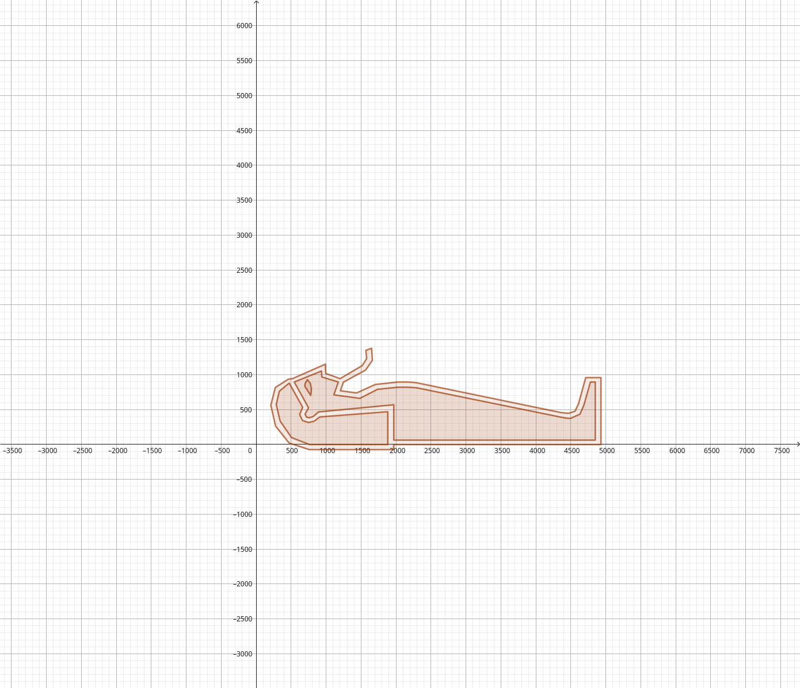
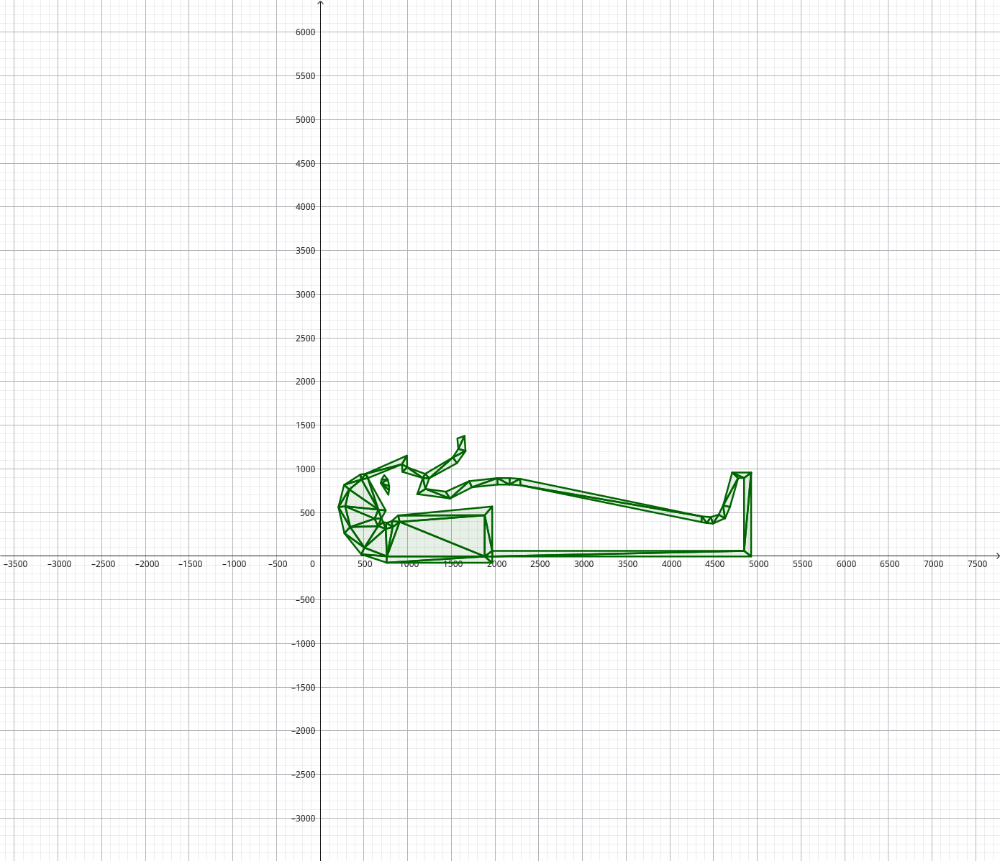
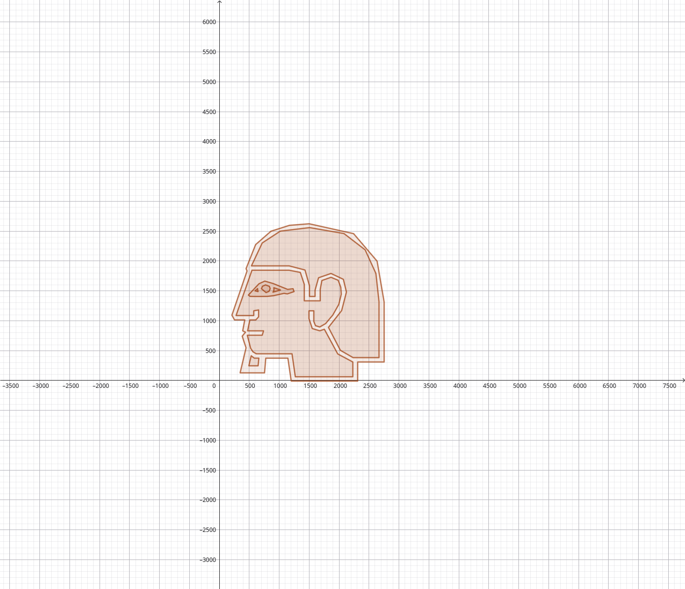
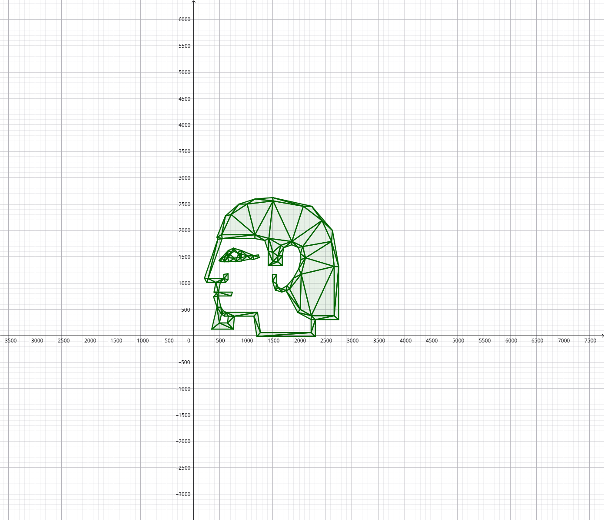
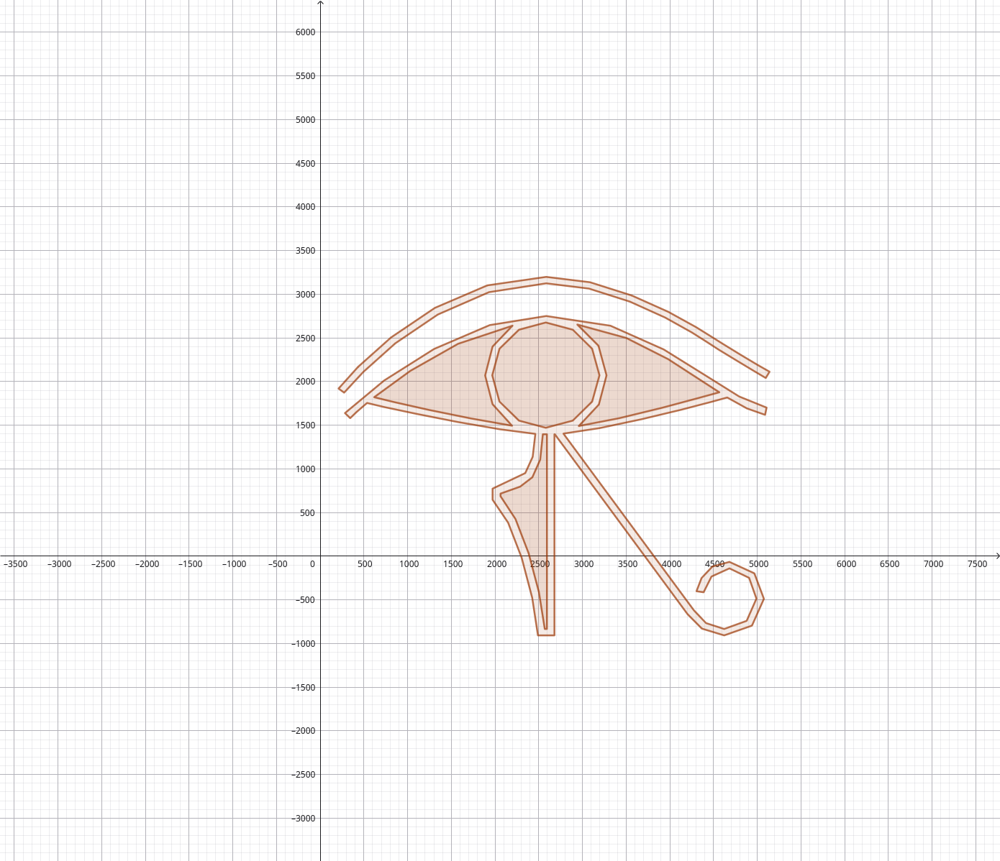
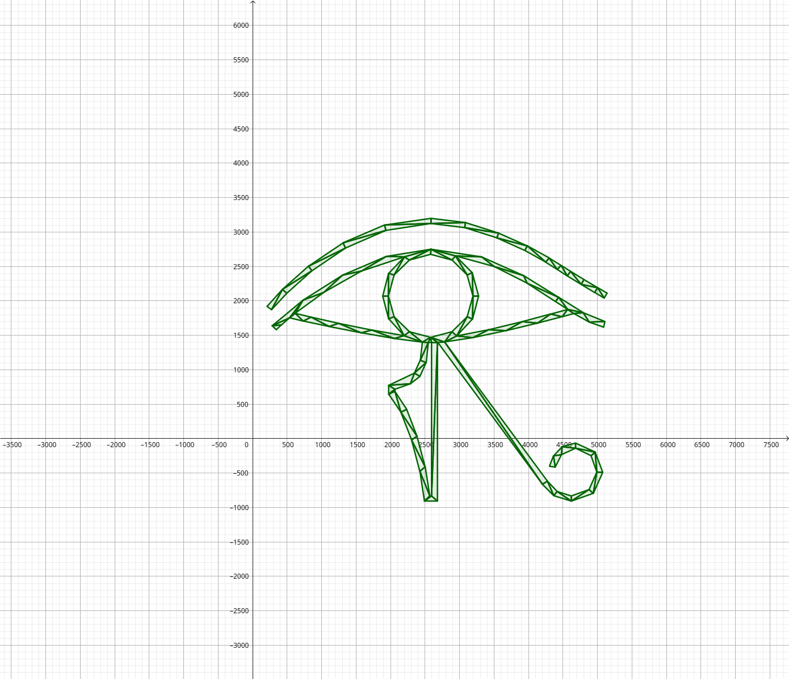

# Zig TTF testing ground 

### Contours

### Triangulation 


### Contours

### Triangulation 


### Contours

### Triangulation 


### what is a contour?

```
pub const Contour = struct {
    segments: std.ArrayList(Segment)
}

pub const Segment = union(enum) {
    line: Line,
    conic: ConicBezier,
    cubic: CubicBezier,

    pub inline fn points(self: Segment) []const Point {
        return switch (self) {
            .line => |s| &[_]Point{ s.start, s.end },
            .conic => |s| &[_]Point{ s.start, s.control, s.end },
            .cubic => |s| &[_]Point{ s.start, s.control_1, s.control_2, s.end },
        };
    }
};
```

The TTF format uses Bezier curves to describe the glyphs. There are many ways to render a glyph, most of them 
revolve around creating a bitmap or texture and multiple magnifications ahead of time and then switching between those. 
This project wants to take a different approach: Extract a triangulation from the glyphs to be rendered as a regular
2D Mesh and add the curves later with a pixel shader. 
